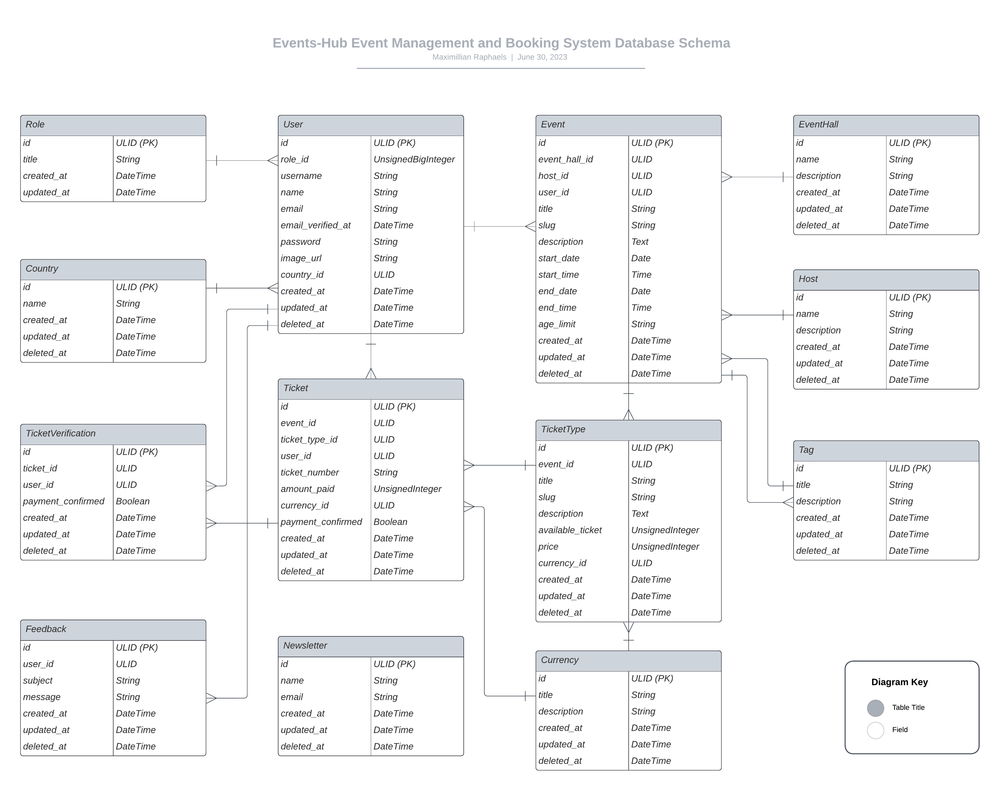

# Events-Hub Events Management and Booking Application

Guide to (usage and description of) the Events-Hub application.

**Table of Contents**

1. [What Events-Hub Is](#what-is-events-hub)
2. [Features of the application](#features-of-the-application)
3. [Technical Features of the Application](#technical-features-of-the-application)
4. [Technologies Utilized in Crafting Events-Hub](#technologies-utilized-in-crafting-events-hub)
   1. [Server-side](#server-side)
   2. [Client-side](#client-side)
5. [API Documentation](#api-documentation)
6. [Database Structure](#database-structure)
7. [How to Install and Run the Events-Hub Application Locally On Your Device](#how-to-install-and-run-the-events-hub-application-locally-on-your-device)
   1. [Requirements](#requirements)
   2. [Installation Procedure](#installation-procedure)
      1. [Server-side Terminal](#server-side-terminal)
      2. [Client-side Terminal](#client-side-terminal)
8. [Footnotes !important](#footnotes-important)

## What Is Events-Hub?

Events-Hub is an events management and booking application where users book (pay online for) events and get their tickets; administrators can add events to be booked.

(gif image showing working application comes here)

## Features of the application

1. There are 3 roles: generic user, admin and superadmin. These roles have different levels of authorization.
2. Users can book tickets to an event.
3. Admin can attend to users queries from their level of authorization.
4. Superadmin can add new events with images.
5. All user roles can register and add images to their profile.

## Technical Features of the Application

1. Authentication
2. Authorization (multiple roles)
3. Access tokens
4. Soft-delete function so that data is never really lost (all deleted data can be retrieved/re-activated)
5. Image upload to the cloud (cloudinary)
6. All incoming requests are validated multiple times on both client side and server-side.
7. API requests rate-limiting to prevent attacks.
8. Other security measures in place to prevent attacks.
9. Multiple error handlers (for both planned and unplanned errors) to catch all errors properly.
10. Plus much more...

## Technologies Utilized in Crafting Events-Hub

Events-Hub is crafted in the following programming languages/frameworks and technologies:

### **Server-side:**

1. **Laravel (PHP)** on the server-side.

   1. **Laravel Tests** (for writing comprehensive tests for the application)

2. **MYSQL** (for database).

### **Client-side:**

1. **React.JS (JavaScript)** library on the client-side
2. **Tailwind CSS** for styling
3. Vanilla **CSS3** for custom styling.

## API Documentation

Here are links to the API documentation. You may wish to view the online version if you do not want to install and run the application locally on your device:

Online version: https://documenter.getpostman.com/view/13239911/2s946bCaXB

Offline version: http://localhost/docs

("localhost" here stands for your local development environment port. Laravel by default runs on localhost:8000. So you would typically view the docs on http://localhost:8000/docs unless you decided to run on a port you set by yourself)

## Database Structure



## How to Install and Run the Events-Hub Application Locally On Your Device

### Requirements:

1. You must have PHP installed on your device. Visit the [official PHP website](https://www.php.net/) and follow the steps for download and installation.

2. After installing PHP, download and install a text editor (e.g. [VS Code](https://code.visualstudio.com/Download)) if you do not have one.

### Installation procedure:

Then go to your terminal and follow these steps:

1. From your terminal, cd (change directory) into your favorite directory (folder) where you would like to have the application files

```
cd C:\Users\maxim\Desktop>
```

Here I changed directory into my personal Desktop space/folder on my Windows Computer. And then;

2. Clone this repository from here on Github using either of the 2 commands on your terminal:

```
git clone https://github.com/maxralph1/events-hub.git
```

or

```
git clone git@github.com:maxralph1/events-hub.git
```

3. And to end this section, CD into the newly installed "events-hub" application file with the following commands.

```
cd events-hub
```

At this point, you must have 2 terminals running (server-side (to run the server side code) and client-side (to consume the server-side API)).

#### Server-side Terminal

1. On the first terminal, change directory into the server file

```
cd server
```

2. From here, use the command below to install all dependencies I utilized in this application as can be seen from my 'server/composer.json' file

```
composer install
```

3. Spin up the server with the command:

```
php artisan serve
```

Your server traditionally starts on port 8000 (http://localhost:8000), if you have nothing currently running this port.

4. Go to the 'server/.env' file which you must have gotten from modifying the 'server/env.example' file and make sure the database name is what you want it to be.

5. You should already have a MySQL database installed and running. Create a database instance with same name as that for the database above. I use XAMPP (you can [get XAMPP here] (https://www.apachefriends.org/download.html)). It makes it easier for me.

6. Go back to your server terminal and run the command to migrate and seed your database:

```
php artisan migrate --seed
```

#### Client-side Terminal

1. On the second terminal, change directory into the server file

```
cd client
```

2. Use the command below to install all dependencies I utilized in this application as can be seen from my 'client/package.json' file

```
npm i
```

3. Spin up the client-side (front-end) to consume the back-end API using the following command:

```
npm run dev
```

Your application should be up on http://localhost:5173/ if you have nothing previously running on the port. Check your terminal to confirm the actual port.

## Footnotes !important

This application is strictly for demonstration purposes. It is not yet production-ready and should never be used as such.

I will continue to gradually update this project in my free time.

\*\*On the general pattern of coding, if you noticed, the entire application has a specific approach in structure. I however decided to deviate (bring in several flavors) a little (but paid attention not to deviate too much) from these principles so as to showcase my skills.
In a real-world application, I would stick to a particular pattern.

Finally, contributions/suggestions on how to improve this project, are welcome .
